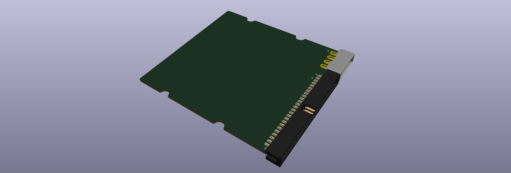

# 3.5" Hard Drive 50-pin SCSI PCB

This reference design is for a 3.5" hard drive 50-pin SCSI PCB with standard spacing for the power and SCSI connectors.

The standard spacing allows the use of the special hard drive connector used on some models of the Macintosh like the Perform/LC 520, 550 and 575.  

There are four different reference PCBs to suite the needs of various projects:

- 3.5" Hard Drive 50-pin SCSI ED

- 3.5" Hard Drive 50-pin SCSI TH

- 3.5" Hard Drive 50-pin SCSI ED 100

- 3.5" Hard Drive 50-pin SCSI TH 100

  

The TH model uses through hole mounting of the connectors. The ED version uses edge/straddle mounting of the connectors. The 100 version of the boards are within the 100mm x 100mm max many PCB manufacturers put as the limit for cheap prices. 

**Note:** The shroud for the TH 50-pin connector will need to be removed and flipped after soldering the connector to the board. Alternatively you can use a connector with no shroud.

The mounting holes of the 3D printed PCB holder is based off of [SFF-8301 Specification](docs/references/SFF-8301-Specification-for-Form-Factor-of-3.5-Disk-Drives-v1.6-March-16-2010.pdf) for Form Factor of 3.5" Disk Drives Rev 1.6, [Quantum ProDrive 40S/80S](docs/references/Quantum_ProDrive_40S_80S_Product_Manual_Jun88.pdf) specs and the [IBM Ultrastar ES DORS 32160](docs/references/ibm_dors_32160.pdf) spec. This should cover the variations of the placement of mounting holes over the years.

## PCB Bill of Materials for ED Version

| Quantity | Description                                   | Designator | Product Number | Datasheet                                         |
| :------- | --------------------------------------------- | ---------- | -------------- | ------------------------------------------------- |
| 1        | 2 x 25-pin male header straight through-hole  | J1         | 350211-1       | [pdf](docs/datasheets/J1_ED_ASS_2314_CO.pdf)      |
| 1        | Mate-n-Lok 4-pin female straight through-hole | J2         | 302-S501       | [pdf](docs/datasheets/J2_ED_ENG_CD_350211_U5.pdf) |

## PCB Bill of Materials for TH Version

| Quantity | Description                                      | Designator | Product Number                                       | Datasheet                                                    |
| :------- | ------------------------------------------------ | ---------- | ---------------------------------------------------- | ------------------------------------------------------------ |
| 1        | 2 x 25-pin male header right angle through-hole  | J1         | 30350-5002HB PREC025DBAN-M71RC (without shroud) | [pdf](docs/datasheets/J1_TH_PAGE122%20.100%20SBH11%20SERIES%20MALE%20BOX%20HDR%20ST%20RA%20SMT.pdf) [pdf (without shroud)](docs/datasheets/J1_TH_11639.pdf) |
| 1        | Mate-n-Lok 4-pin female right angle through-hole | J2         | 770846-1                                             | [pdf](docs/datasheets/J2_TH_ENG_CD_770846_B.pdf)             |

## 3D Models

As usual I try to minimize the need for support and only the top case needs them for where the screws go. Choose whatever infill percentage you desire. The top cover screws are M3 which are used by CD drives and floppy drives. The side and bottom screws are sized for standard #6-32 UNC screws used to mount hard drives. The holes are tapered to help tapping the holes with the screws.

### Edge Connector PCB Cases

| Full size case with openings  [download](3d_models/3.5_Hard_Drive_Case_50-pin_SCSI_TH.zip) | **Full size case with openings**  [download](3d_models/3.5_Hard_Drive_Case_50-pin_SCSI_TH_openings.zip) |
| :----------------------------------------------------------: | :----------------------------------------------------------: |
| **100mm pcb case**  [**download**](3d_models/3.5_Hard_Drive_Case_50-pin_SCSI_TH_100.zip) | **100mm pcb case with openings**  [**download**](3d_models/3.5_Hard_Drive_Case_50-pin_SCSI_TH_100_openings.zip) |

### Edge Connector PCB Cases

| Full size case with openings  [download](3d_models/3.5_Hard_Drive_Case_50-pin_SCSI_ED.zip) | **100mm pcb case**  [download](3d_models/3.5_Hard_Drive_Case_50-pin_SCSI_ED_openings.zip) |
| :----------------------------------------------------------: | :----------------------------------------------------------: |
| **Full size case with openings**  **[download](3d_models/3.5_Hard_Drive_Case_50-pin_SCSI_ED_100.zip)** | **100mm pcb case with openings**  [**download**](3d_models/3.5_Hard_Drive_Case_50-pin_SCSI_ED_100_openings.zip) |

## Case Bill of Materials

| Quantity | Description                 |
| :------- | --------------------------- |
| 6        | M3 pan head screw 5mm - 7mm |

## Case Bill of Materials for 100mm PCB

| Quantity | Description                 |
| :------- | --------------------------- |
| 4        | M3 pan head screw 5mm - 7mm |

## Todo

- Add schematic symbols for the SCSI and power connectors
- Create 3D model to help align connectors when soldering

## License

Reference Design Library by <a xmlns:cc="http://creativecommons.org/ns#" href="https://github.com/alxlab-zone66x/Reference_Design_Library/tree/main" property="cc:attributionName" rel="cc:attributionURL">Alexandre Marcoux</a> is licensed under a <a rel="license" href="http://creativecommons.org/licenses/by/4.0/">Creative Commons Attribution 4.0 International License</a>.

## Community

For more great retro hardware projects and a great community check out:

Join us in #skunkworks on [Discord](https://discord.gg/GKcvtgU7P9) to help make retro solutions available to all.

