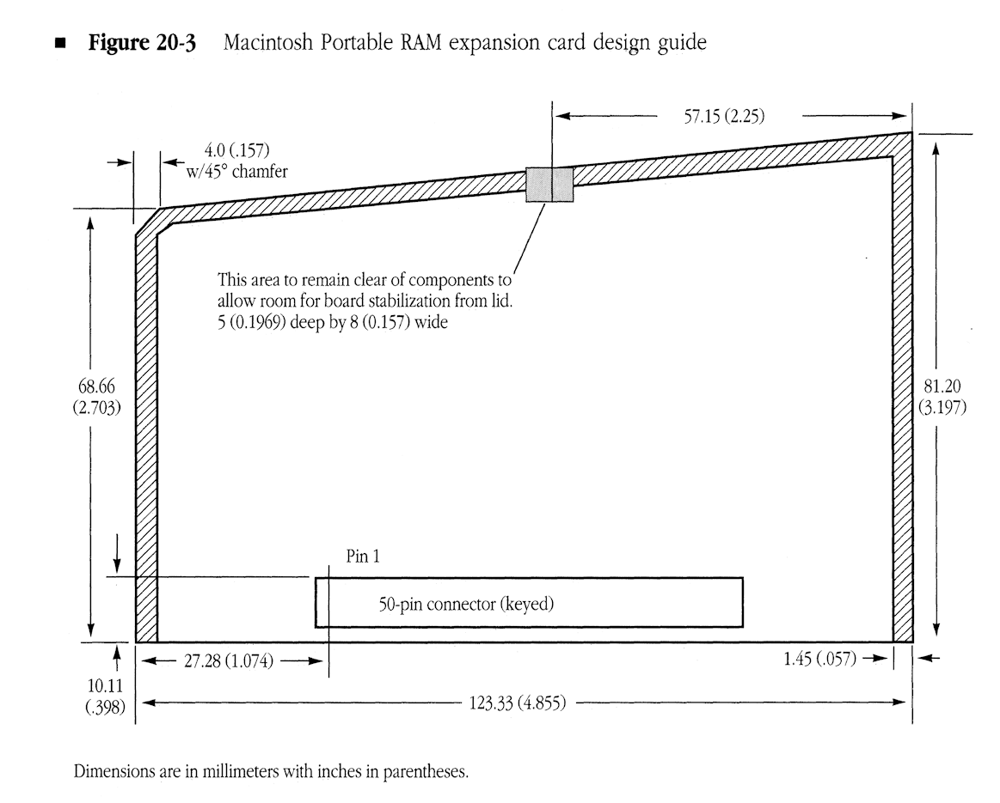
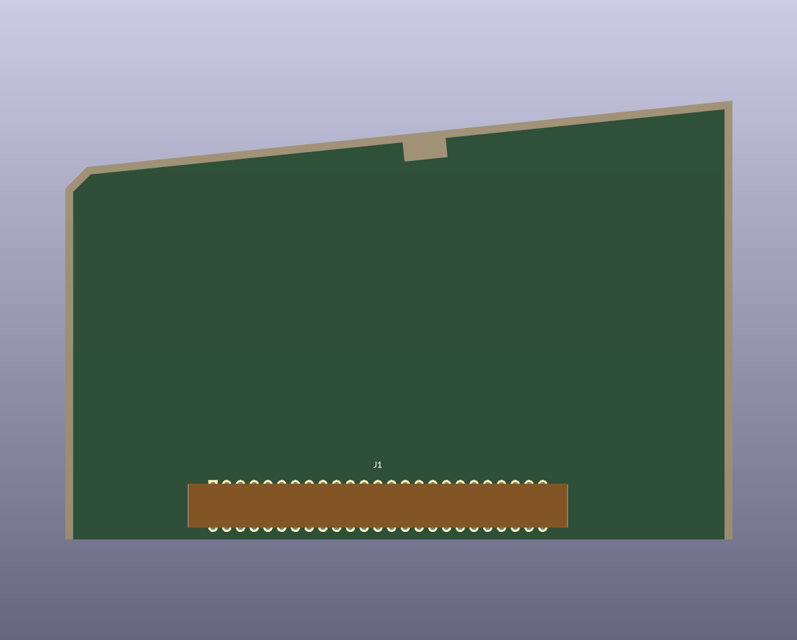
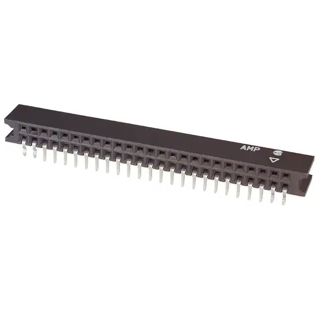
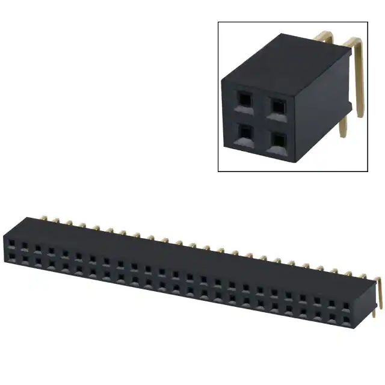

[Reference Design Library](https://github.com/alxlab-zone66x/Reference_Design_Library)

# Macintosh Portable RAM Expansion Card

This is the Kicad 6 schematics and PCB with connector to serve as the basis to make a Macintosh Portable RAM expansion card. The PCB was designed based off the dimensions shown on page 450 of the [Designing Cards and Drivers for -the Macintosh Family Third Edition](../docs/books/Designing_Cards_and_Drivers_for_the_Macintosh_Family_3rd_Edition_1992.pdf#page=491). I made two versions of the board with different connectors. One uses the original AMPMODU Mod II / Mod IV connector and the other uses a cheaper and easier to get female right-angle 50-pin connector.

Note that the schematic symbol for the connector notes the pins names for the M5120 non-backlit Macintosh Portable. For M5126 backlit Macintosh Portable pins 28 and 32 are defined as /RAM.CS and /REFRESH instead of /AS and /DELAY.CS respectively.   

## Bill of Materials

AMPMODU Mod II / Mod IV connector version:

| Image                                                        | Quantity | Product Number                              | Datasheet                                                    |
| ------------------------------------------------------------ | :------- | ------------------------------------------- | ------------------------------------------------------------ |
|  | 1        | 66527-025LF 5-532956-8 5-534204-1 | [pdf](docs/datasheets/J1_66527.pdf) [pdf](docs/datasheets/J1_ENG_CD_532956_AF3.pdf) [pdf](docs/datasheets/J1_ENG_CD_532956_AF3.pdf) |

Right-angle connector version:

|                                                              | Quantity | Product Number | Datasheet                                       |
| ------------------------------------------------------------ | :------- | -------------- | ----------------------------------------------- |
|  | 1        | PPPC252LJBN-RC | [pdf](docs/datasheets/J1_Right-Angle_10494.pdf) |

## License

Connector Shield for Macintosh II-Family Computer by <a xmlns:cc="http://creativecommons.org/ns#" href="https://github.com/alxlab-zone66x/Reference_Design_Library/tree/main/Connector%20Shield%20for%20Macintosh%20II-Family%20Computer" property="cc:attributionName" rel="cc:attributionURL">Alexandre Marcoux</a> is licensed under a <a rel="license" href="http://creativecommons.org/licenses/by/4.0/">Creative Commons Attribution 4.0 International License</a>.

## Community

For more great retro hardware projects and a great community check out:

Join us in #skunkworks on [Discord](https://discord.gg/GKcvtgU7P9) to help make retro solutions available to all.

